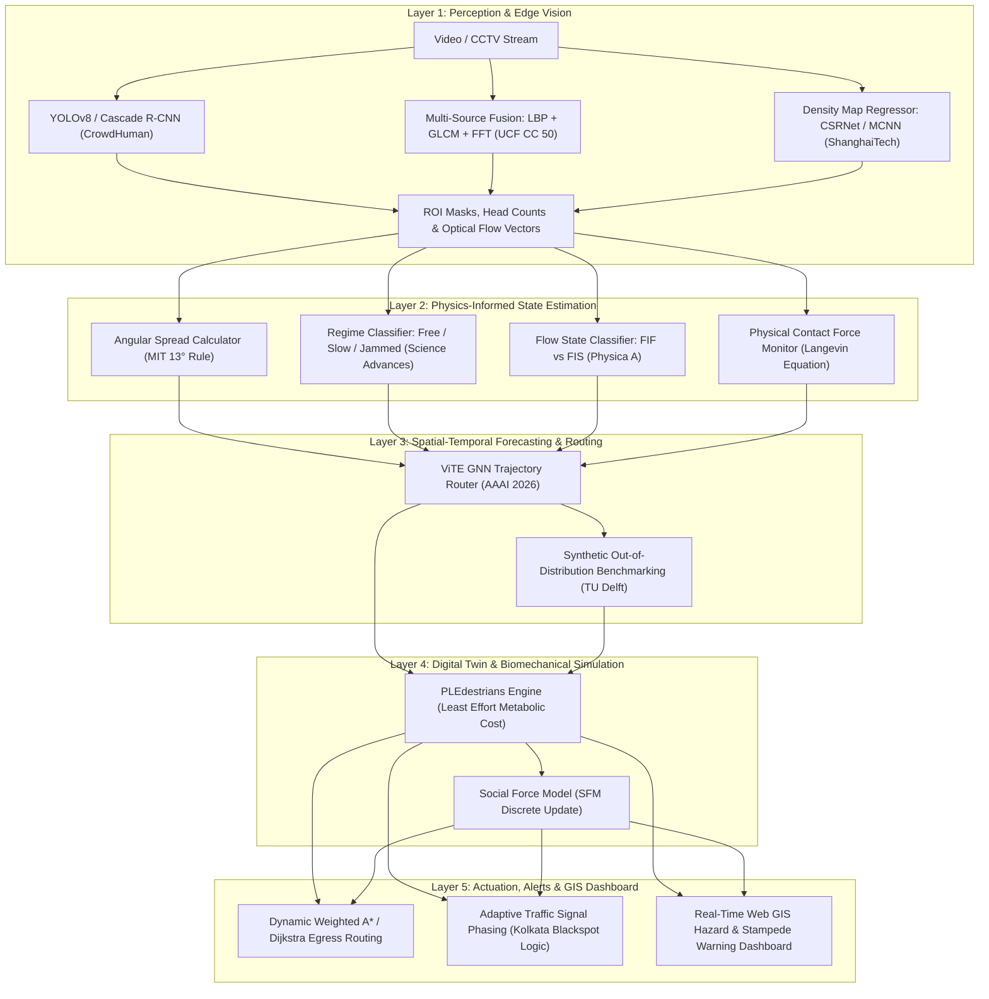

# Master Research Summary & Computer Science Solution Framework
## The Pedestrian Crowd Problem: Modeling, Perception, Simulation & Urban Safety

**Repository:** `kodo-kaze/PROJ`  
**Compiled For:** Team Research Synthesis & Final Year Project Core System Design  
**Scope:** Complete literature review, mathematical formulations, dataset benchmarks, and an end-to-end Computer Science system architecture.

---

## Table of Contents
1. [Executive Summary & Problem Definition](#1-executive-summary--problem-definition)
2. [Comprehensive Literature Review by Research Stream](#2-comprehensive-literature-review-by-research-stream)
   - [2.1. Physical Dynamics, Regime Transitions & Mathematical Modeling](#21-physical-dynamics-regime-transitions--mathematical-modeling)
   - [2.2. Biomechanical & Energy-Optimal Simulation Engines](#22-biomechanical--energy-optimal-simulation-engines)
   - [2.3. Computer Vision, Feature Extraction & Density Segmentation](#23-computer-vision-feature-extraction--density-segmentation)
   - [2.4. Deep Learning Architectures, GNNs & Trajectory Prediction](#24-deep-learning-architectures-gnns--trajectory-prediction)
   - [2.5. Real-World Urban Vulnerability & Infrastructure Case Studies](#25-real-world-urban-vulnerability--infrastructure-case-studies)
3. [Benchmark Datasets & Evaluation Metrics](#3-benchmark-datasets--evaluation-metrics)
4. [Master Literature Matrix & Source Catalog](#4-master-literature-matrix--source-catalog)
5. [End-to-End Computer Science Solution Architecture](#5-end-to-end-computer-science-solution-architecture)
   - [5.1. Layer 1: Multi-Scale Perception & Computer Vision](#51-layer-1-multi-scale-perception--computer-vision)
   - [5.2. Layer 2: Physics-Informed State Estimation & Regime Classification](#52-layer-2-physics-informed-state-estimation--regime-classification)
   - [5.3. Layer 3: Spatial-Temporal Forecasting & GNN Trajectory Routing](#53-layer-3-spatial-temporal-forecasting--gnn-trajectory-routing)
   - [5.4. Layer 4: Digital Twin & Biomechanical Simulation Engine](#54-layer-4-digital-twin--biomechanical-simulation-engine)
   - [5.5. Layer 5: Actuation, Adaptive Signals & Emergency GIS Dashboard](#55-layer-5-actuation-adaptive-signals--emergency-gis-dashboard)
6. [Algorithmic Workflows & Mathematical Reference](#6-algorithmic-workflows--mathematical-reference)
7. [Team Contribution & Workspace Audit](#7-team-contribution--workspace-audit)

---

## 1. Executive Summary & Problem Definition

The **Pedestrian Crowd Problem** arises when large densities of people occupy or traverse constrained spatial environments (transit hubs, stadiums, festivals, crosswalks, narrow corridors, and urban bottlenecks), leading to:
- **Severe Mobility Degradation:** Bottlenecks, turbulent counterflows, arching, and "freezing by heating" gridlocks.
- **Extreme Safety Hazards:** Compressive asphyxia, crowd collapses, stampedes, and vehicular-pedestrian conflict in high-density urban corridors.
- **Surveillance & Planning Deficiencies:** Inability of legacy manual monitoring or naive heuristic algorithms to predict sudden non-linear phase transitions from fluid movement into dangerous jamming.

Solving this problem in **Computer Science** requires bridging the gap between **macroscopic fluid/granular physics**, **microscopic multi-agent simulations**, **edge computer vision (CV)**, and **real-time spatial-temporal deep learning**.

```text
┌────────────────────────────────────────────────────────────────────────────────────────┐
│                                 THE PEDESTRIAN CROWD PROBLEM                           │
└───────────────────────────────────────────┬────────────────────────────────────────────┘
                                            │
           ┌────────────────────────────────┼────────────────────────────────┐
           ▼                                ▼                                ▼
  [Perception & CV]               [Dynamics & Physics]             [Forecasting & Routing]
  - Heavy Occlusion               - Jamming Regimes                - High-Order Multi-Agent GNNs
  - Scale & Perspective Shifts    - Angular Spread Disruption      - Biomechanical Least Effort
  - Static vs Moving Crowds       - Mechanical Contact Pressure    - Real-Time Adaptive Egress
```

---

## 2. Comprehensive Literature Review by Research Stream

### 2.1. Physical Dynamics, Regime Transitions & Mathematical Modeling

#### A. The Social Force Model (SFM) & Self-Organized Dynamics
* **Source:** *Self-Organized Pedestrian Crowd Dynamics* ([Frankfurt University Simulation Applet](https://itp.uni-frankfurt.de/~gros/StudentProjects/Applets_2014_PedestrianCrowdDynamics/PedestrianApplet.html))
* **Core Physics:** Pedestrian motion is modeled through continuous Newtonian mechanics governed by internal motivations and social/physical interaction forces:
  $$\vec{f}_{\alpha}(t) = \vec{f}^{0}_{\alpha} + \vec{f}_{\alpha B} + \sum_{\beta \neq \alpha}\vec{f}_{\alpha \beta} + \sum_{i}\vec{f}_{\alpha i}$$
  - **Self-Driving Force ($\vec{f}^{0}_{\alpha}$):** Directs the agent to destination $\vec{e}^0_\alpha$ with desired speed $v^0_\alpha$ over relaxation time $\tau \approx 1\text{ s}$:
    $$\vec{f}^{0}_{\alpha} = m_\alpha \frac{v^0_\alpha \vec{e}^0_\alpha - \vec{v}_\alpha}{\tau}$$
  - **Repulsive Inter-Agent Force ($\vec{f}_{\alpha \beta}$):** Exponential spatial decay reflecting personal space requirements:
    $$\vec{f}_{\alpha \beta} = A_\alpha \exp\left(\frac{r_{\alpha\beta} - d_{\alpha\beta}}{B_\alpha}\right) \vec{n}_{\alpha\beta} \cdot w(\varphi_{\alpha\beta}, \lambda_\alpha)$$
  - **Anisotropic Field of View ($w(\varphi_{\alpha\beta}, \lambda_\alpha)$):** Asymmetrical perception weight ($\lambda \approx 0.75$) ensuring pedestrians react predominantly to obstacles in their forward field of view ($180^\circ$).
* **Emergent Collective Phenomena:**
  - **Dynamic Lane Formation ($180^\circ$ Counterflow):** Opposing streams segregate into alternating lanes to minimize braking and evasive maneuvers.
  - **Stripe Formation ($0^\circ - 180^\circ$ Intersecting Flows):** Intersecting flows form diagonal density waves oriented along the vector sum of both streams, allowing mutual interpenetration.
  - **"Freezing by Heating":** Under extreme panic or velocity elevation ($v_0 \gg$), high lateral fluctuations cause lane collapse into total gridlock.

#### B. Angular Spread & The 13-Degree Order-Disorder Transition
* **Source:** *Mathematicians uncover the logic behind how people walk in crowds* ([MIT News / PNAS 2025](https://news.mit.edu/2025/mathematicians-uncover-logic-behind-how-crowds-walk-0324))
* **Authors:** Karol Bacik, Grzegorz Sobota, Bogdan Bacik, Tim Rogers.
* **Core Discovery:** The stability of self-organized counterflow lanes is governed strictly by **angular spread** (the angular variance of individual trajectory vectors).
* **The 13-Degree Threshold:**
  - $\theta_{\text{spread}} < 13^\circ$: Smooth, high-efficiency lane formation occurs naturally.
  - $\theta_{\text{spread}} \ge 13^\circ$: Lane structure destabilizes into disordered turbulent flow. Evasive maneuvers multiply, causing a sharp drop in overall crowd throughput.
* **Validation:** Validated using fluid-flow continuum equations and controlled human experiments using overhead camera tracking and barcode-encoded participant markers.

```text
    Small Angular Spread (< 13°)             Large Angular Spread (> 13°)
    ────────────────────────────             ────────────────────────────
        → → → → → → → → → →                      ↗   →   ↘   ↑   →
        → → → → → → → → → →                        ↖   ↓   ↙   ↘
        ← ← ← ← ← ← ← ← ← ←                      ←   ↗   ←   ↓   ↖
        ← ← ← ← ← ← ← ← ← ←                        ↙   ↘   ↑   →   ↙
    [Organized Lanes / Fast Flow]            [Disordered Flow / Severe Dodging]
```

#### C. Dimensionless Numbers in Crowd Physics
* **Source:** *PNAS Nexus (2024)* ([Paper Link](https://academic.oup.com/pnasnexus/article/3/4/pgae120/7632022))
* **Core Concept:** Analogous to the Reynolds number ($Re$) in fluid mechanics, crowd states cannot be characterized by density ($\rho$) alone. Two dimensionless variables quantify risk regimes:
  1. **Intrusion Number ($In$):** Quantifies the psychological violation of personal space.
  2. **Avoidance Number ($Av$):** Measures the anticipatory physical deceleration required to prevent immediate collisions.
* **Application:** Provides mathematical boundaries to calibrate simulation engines and classify risk states without relying on arbitrary ad-hoc thresholds.

#### D. Bottom-Up Foot-Tracking & Density Regimes
* **Source:** *Science Advances (2025)* ([Paper Link](https://doi.org/10.1126/sciadv.adw2688))
* **Methodology:** Large-scale experimental platform utilizing a transparent glass floor with high-speed bottom-up camera tracking of individual foot kinematics (step length, step frequency, contact duration, and gait angle).
* **The Three Dynamical Regimes:**
  1. **Free Regime ($\rho < 0.75\text{ persons/m}^2$):** Unconstrained walking speed; independent heading.
  2. **Slow-Moving Regime ($0.75 \le \rho \le 1.80\text{ persons/m}^2$):** Speed drops primarily due to shortening step length, while step frequency and heading remain flexible.
  3. **Jammed Regime ($\rho > 1.80\text{ persons/m}^2$):** Step length and step frequency collapse; directional movement is severely restricted.
* **Footstep Synchronization:** Spontaneous in-phase synchronization of footsteps peaks exactly at the transition boundary ($\rho \approx 1.80\text{ persons/m}^2$), occurring more frequently with pedestrians directly in front than with people beside them, serving as a critical leading indicator for jamming and stampede vulnerability.

#### E. 3D Multiscale Dynamics & Granular Force Transmission
* **Source:** *Exploring Dense Crowd Dynamics: State of the Art and Emerging Paradigms* ([arXiv:2505.05826](https://arxiv.org/abs/2505.05826), Jülich & Wuppertal)
* **Authors:** Thomas Chatagnon, Antoine Tordeux, Mohcine Chraibi.
* **Physics of Extreme Density ($\rho > 6\text{ persons/m}^2$):** 2D behavioral models fail because individual psychological intent is overwhelmed by physical force propagation. Crowds behave as compressible granular fluids governed by an extended Langevin-type equation:
  $$m_i \frac{d\vec{v}_i}{dt} = \vec{F}_i^{\text{drv}} + \sum_{j \neq i} \vec{F}_{ij}^{\text{rep}} + \sum_{j \neq i} \vec{F}_{ij}^{\text{c}}$$
  where $\vec{F}_{ij}^{\text{c}}$ represents physical contact forces (compression, friction, wedging).
* **Failure Modes:** When $|\sum \vec{F}^{\text{c}}| \gg |\vec{F}^{\text{drv}}|$, pressure waves propagate across the crowd, triggering balance loss, collective falls ("crowd collapses"), and compressive asphyxia (as documented in the 2010 Love Parade tragedy).

#### F. Revisiting "Faster-is-Slower" vs "Faster-is-Faster"
* **Source:** *Pedestrian crowd dynamics in merging sections: Revisiting the “faster-is-slower” phenomenon* ([Physica A / ScienceDirect](https://www.sciencedirect.com/science/article/abs/pii/S0378437117308956))
* **Core Takeaway:** The classical "Faster-is-Slower" (FIS) hypothesis (where higher escape desire causes total clogging) is **not universal**. Empirical trials with 150 participants showed **"Faster-is-Faster" (FIF)** in merging corridors.
* **Boundary Condition:** FIS only triggers at extreme physical choke points where corridor exit width $W < W_{\text{crit}}$ ($<0.8\text{ m}$). In open and merging layouts, higher velocity improves aggregate evacuation throughput.

---

### 2.2. Biomechanical & Energy-Optimal Simulation Engines

#### PLEdestrians: Principle of Least Effort Crowd Simulation
* **Source:** *PLEdestrians: A Least-Effort Approach to Crowd Simulation* ([Eurographics / ACM SIGGRAPH 2010](http://gamma.cs.unc.edu/PLEdestrians/), [YouTube Video](https://youtu.be/hpYdjHzHTkY?si=UllOyl_5U_O6Unr2))
* **Authors:** Stephen J. Guy, Jatin Chhugani, Sean Curtis, Pradeep Dubey, Ming Lin, Dinesh Manocha (UNC Chapel Hill & Intel).
* **Core Formulation:** Grounded in George Zipf’s Principle of Least Effort (PLE) and Whittle’s biomechanical locomotion power equations. Agents minimize total metabolic energy expenditure:
  $$E_{\text{total}} = E_{\text{immediate}}(\vec{v}_{\text{step}}) + E_{\text{estimated}}(\text{remaining path})$$
* **Locomotion Energy Curve:** Metabolic cost is non-linear with respect to speed $v$, having a natural global minimum at typical human walking speed ($1.3 - 1.4\text{ m/s}$):
  $$P(v) = \frac{E}{\Delta t} = m \cdot (\alpha + \beta v^2)$$
* **Algorithmic Properties:**
  - **Inductive Greedy Optimization:** Solves convex velocity-space optimizations with spatial clustering, enabling real-time simulation of thousands of agents on a desktop PC.
  - **Emergent Realism:** Naturally reproduces arching around exits, wake effects (empty corners behind obstacles), edge effects (higher speed along boundary walls), smooth collision avoidance without jitter/oscillation, and proactive detour routing around visible congestion without explicit heuristic rules.
  - **Optimality:** Trajectories are within 1% of theoretical energy optimality (compared to Social Force Models which expend ~17% excess energy).
  - **Real-World Validation:** Validated against empirical datasets and video footage of Tokyo's Shibuya Station crossing.

```text
    [Standard Shortest-Path (Dijkstra/A*)]
    Agent ──────────► [ Dense Bottleneck (Stalls, High Energy) ] ──────────► Goal

    [PLEdestrian Least-Effort Optimization]
    Agent ────┬─────► [ Proactive Detour via Open Floor Space ] ──────────► Goal
              └───► (Avoids bottleneck proactively, minimizes metabolic cost)
```

---

### 2.3. Computer Vision, Feature Extraction & Density Segmentation

#### A. Multi-Source Appearance & Texture Feature Fusion
* **Source:** *Pedestrian Crowd Detection and Segmentation using Multi-Source Feature Descriptors* ([IJACSA 2020](https://thesai.org/Publications/ViewPaper?Volume=11&Issue=1&Code=IJACSA&SerialNo=87))
* **Authors:** Saleh Basalamah, Sultan Daud Khan.
* **Core Problem:** Motion segmentation fails when crowds are stationary and introduces false positives from non-human movement. Extreme occlusion prevents individual body detection.
* **Pipeline:**
  1. Divide image into dense overlapping blocks and $32 \times 32$ pixel cells.
  2. Extract 3 complementary feature descriptors:
     - **Local Binary Pattern (LBP):** Captures micro-texture and edge distribution using 8 neighbors.
     - **Gray-Level Co-occurrence Matrix (GLCM):** Computes pixel pair spatial relations across $0^\circ, 45^\circ, 90^\circ, 135^\circ$ to extract **Entropy, Energy, Contrast, and Homogeneity**.
     - **Fourier Analysis (FFT):** 2D FFT on patch gradients $\to$ Low-Pass Filter $\to$ Threshold low amplitudes ($<0.4$) $\to$ Inverse FFT $\to$ Non-Maxima Suppression (NMS) $\to$ Extracts **Mean, Variance, Skewness, and Kurtosis** of repetitive head patterns.
  3. **Feature Fusion:** Concatenates descriptors into a **128-element feature vector**.
  4. **Classification & Smoothing:** Linear Support Vector Machine (SVM) classifies each cell as crowd/non-crowd $\to$ smoothed by an $11 \times 11$ 2D Gaussian kernel.
* **Benchmark:** Evaluated on UCF CC 50 dataset (50 scenes, 94 to 4,543 persons/frame), achieving **$\text{AUC} = 0.63$**, outperforming GMM ($0.27$), MEOF ($0.15$), HOG+SVM ($0.45$), SIFT+SVM ($0.56$), and standalone LBP ($0.58$).

```text
                Input Frame
                     │
                     ▼
             Divide into Cells (32x32)
                     │
          ┌──────────┼──────────┐
          ▼          ▼          ▼
         LBP      Fourier      GLCM
      (Texture)  (Periodicity) (Co-occurrence)
          │          │          │
          └──────────┼──────────┘
                     ▼
            128-Element Vector
                     │
                     ▼
             Linear SVM Classifier
                     │
                     ▼
           11x11 Gaussian Smoothing
                     │
                     ▼
            Crowd Region Mask (ROI)
```

#### B. Cascade R-CNN & Multi-Task Deep Crowd Detection
* **Source:** *A pedestrian detection algorithm based on deep learning* ([ACM ICCSIE 2022](https://doi.org/10.1145/3558819.3565151))
* **Authors:** Jiangkun Lu, Hongyang Chen.
* **Architecture:** VGG16 backbone combined with $1\times1$ and $3\times3$ convolutions for multi-scale feature representation.
* **Cascade IoU Resampling:** Integrates multi-stage Cascade R-CNN structure with progressive IoU thresholds ($0.5 \to 0.6 \to 0.7$) to eliminate positive sample degradation during training.
* **Loss Optimization:** Multi-task loss combined via Hadamard product to output precise bounding boxes and crowd counts on the WorldExpo'10 benchmark. Addresses Fruin's critical crowd density threshold ($0.15\text{ m}^2/\text{person}$).

---

### 2.4. Deep Learning Architectures, GNNs & Trajectory Prediction

#### A. ViTE: Virtual Graph Trajectory Expert Router
* **Source:** *ViTE: Virtual Graph Trajectory Expert Router for Pedestrian Trajectory Prediction* ([AAAI 2026](https://github.com/Carrotsniper/ViTE), Durham & Southampton)
* **Authors:** Ruochen Li, Zhanxing Zhu, Tanqiu Qiao, Hubert P. H. Shum.
* **Core Problem:** Standard Graph Neural Networks (GNNs) face a dilemma: shallow GNNs suffer from under-reaching (missing distant coordinated interactions), while deep GNN stacks suffer from over-smoothing and high computational latency.
* **Architecture:**
  - **Dynamic Virtual Graph:** Introduces virtual super-nodes that aggregate global context and high-order interactions in a single hop without deep layer stacking.
  - **Expert Router (Mixture-of-Experts / MoE):** Dynamically assigns individual agents to specialized interaction experts based on local density and social context.
  - **Probabilistic Forecasting:** Predicts parameters for a bivariate Gaussian distribution over future coordinates:
    $$\hat{Y} = \{\hat{p}_i^{(t+1)}, \dots, \hat{p}_i^{(t+T_{\text{pred}})}\}, \quad \hat{p}_i^{(t)} \sim \mathcal{N}(\vec{\mu}_i^{(t)}, \mathbf{\Sigma}_i^{(t)})$$
  - **Dynamic Collision Avoidance:** Dynamically shifts graph attention weights when interpersonal distance $\|p_i - p_j\|_2 < \epsilon$.
* **Benchmark:** State-of-the-art accuracy on ETH/UCY, Stanford Drone Dataset (SDD), and NBA trajectory benchmarks.

#### B. Indoor Crowd Flow Forecasting & Synthetic Benchmarking
* **Source:** *Evaluating Crowd Flow Forecasting Algorithms for Indoor Pedestrian Spaces: A Benchmark Using a Synthetic Dataset* ([IEEE T-ITS 2025](https://doi.org/10.1109/TITS.2025.3559353), TU Delft)
* **Authors:** Weiming Mai, Dorine Duives, Panchamy Krishnakumari, Serge Hoogendoorn.
* **Core Findings:**
  - Standard time-series deep learning models (LSTM, GRU, Transformers) trained on routine indoor flows fail catastrophically when evaluated on unseen emergency/evacuation scenarios due to out-of-distribution shifts.
  - Generates synthetic simulation benchmarks to provide out-of-distribution training regimes.
  - Establishes continuous ground truth density mapping:
    $$D(x) = \sum_{i=1}^N \delta(x - x_i) * G_{\sigma}(x)$$
  - Evaluates models against the fundamental equation of traffic flow ($q = \rho \cdot v$).

---

### 2.5. Real-World Urban Vulnerability & Infrastructure Case Studies

#### A. Kolkata / West Bengal Pedestrian Vulnerability & Safety Interventions
* **Source:** *Kolkata’s road-safety push must begin with pedestrians: IIT transport expert* ([Times of India / MoRTH Data](https://timesofindia.indiatimes.com/city/kolkata/kolkatas-road-safety-push-must-begin-with-pedestrians-iit-transport-expert/articleshow/133293532.cms))
* **Empirical Reality:**
  - Pedestrians constitute **$>50\%$ of all road fatalities** in West Bengal and Bihar (compared to the ~20% national average).
  - Fatalities in West Bengal rose by **10.77%** in 2024 ($6,676$ deaths) despite a minor decrease in total vehicle crashes.
* **Root Causes:** Severe sidewalk encroachment, hawker stalls, mixed-traffic friction, and lack of segregated transit egress around Metro, bus, and ferry terminals.
* **Target Computer Science Deliverables:**
  1. **Encroachment & Spillover Detection:** Edge CV models detecting when pedestrian queues spill off sidewalks into vehicular lanes.
  2. **Adaptive Signal Phasing:** Dynamically extending pedestrian crossing signal green-time based on real-time camera-detected queue density.
  3. **Centralized Pedestrian Safety GIS Dashboard:** Spatial black-spot identification and temporal risk indexing.

#### B. Accident Analysis & Prevention Infrastructure Modeling
* **Source:** *Accident Analysis & Prevention (2026)* ([ScienceDirect](https://www.sciencedirect.com/science/article/abs/pii/S0001457526000916?via%3Dihub))
* **Core Focus:** Translating behavioral theories into actionable accident prevention frameworks, focusing on crosswalk safety, transit intersections, and crowd control protocols.

#### C. Special Issue on CV, AI & Crowd Dynamics
* **Source:** *Pedestrians & Crowds - Crowd safety and pedestrian traffic* ([ScienceDirect](https://www.sciencedirect.com/special-issue/100PZRGHRL6))
* **Core Scope:** Bridging experimental crowd dynamics with CV/AI for field data collection, model calibration, real-time feedback, and emergency optimization.

---

## 3. Benchmark Datasets & Evaluation Metrics

| Dataset | Modality & Scope | Target Task | Key Metrics |
| :--- | :--- | :--- | :--- |
| **ShanghaiTech (Part A & B)** | 1,198 images (Part A: 482 dense / Part B: 716 sparse surveillance) | Density Map Regression & Crowd Counting | $\text{MAE} = \frac{1}{N}\sum \|C_i - \hat{C}_i\|$, $\text{RMSE} = \sqrt{\frac{1}{N}\sum (C_i - \hat{C}_i)^2}$ |
| **CrowdHuman (Kaggle)** | ~15,000 images, YOLO annotations | Dense Human Detection & Occlusion Bounding | Precision, Recall, mAP@0.5, mAP@0.5:0.95 |
| **UCF CC 50** | 50 extremely dense images (94 to 4,543 persons/frame) | Single-Image Crowd Segmentation & Detection | ROC Curve, Area Under Curve ($\text{AUC}$) |
| **WorldExpo'10** | Multi-scene surveillance video dataset | Multi-Stage Pedestrian Detection & Counting | Mean Absolute Error ($\text{MAE}$), Mean Squared Error ($\text{MSE}$) |
| **ETH / UCY / SDD** | Trajectory coordinates across indoor/outdoor crowds | Microscopic Trajectory Forecasting | Average Displacement Error ($\text{ADE}$), Final Displacement Error ($\text{FDE}$) |

---

## 4. Master Literature Matrix & Source Catalog

| Domain / Stream | Publication / Venue | Key Authors / Institutions | Core Topic / Discovery |
| :--- | :--- | :--- | :--- |
| **GNN Trajectory Routing** | AAAI 2026 | Li, Zhu, Qiao, Shum (Durham / Southampton) | [ViTE: Virtual Graph Trajectory Expert Router](https://github.com/Carrotsniper/ViTE) |
| **Indoor Flow Forecasting** | IEEE T-ITS 2025 | Mai, Duives, Krishnakumari, Hoogendoorn (TU Delft) | [Synthetic Benchmark for Indoor Crowd Forecasting](https://doi.org/10.1109/TITS.2025.3559353) |
| **3D Granular Dynamics** | arXiv 2025 | Chatagnon, Tordeux, Chraibi (Jülich / Wuppertal) | [Dense Crowd Dynamics & Contact Mechanics](https://arxiv.org/abs/2505.05826) |
| **Order-Disorder Transition** | PNAS / MIT News 2025 | Bacik, Sobota, Bacik, Rogers (MIT / Katowice / Bath) | [13° Angular Spread Transition in Crowds](https://news.mit.edu/2025/mathematicians-uncover-logic-behind-how-crowds-walk-0324) |
| **Footstep Kinematics** | Science Advances 2025 | Research Team | [Foot-Tracking & Jamming Synchronization](https://doi.org/10.1126/sciadv.adw2688) |
| **Dimensionless Physics** | PNAS Nexus 2024 | Research Team | [Intrusion & Avoidance Dimensionless Numbers](https://academic.oup.com/pnasnexus/article/3/4/pgae120/7632022) |
| **Deep Pedestrian Detection** | ACM ICCSIE 2022 | Lu, Chen (Chongqing College) | [Cascade R-CNN Pedestrian Detection](https://doi.org/10.1145/3558819.3565151) |
| **Feature Fusion Segmentation** | IJACSA 2020 | Basalamah, Khan (Umm Al-Qura / NUTECH) | [LBP + GLCM + Fourier SVM Segmentation](https://thesai.org/Publications/ViewPaper?Volume=11&Issue=1&Code=IJACSA&SerialNo=87) |
| **Merging Flow Dynamics** | Physica A 2017 | Research Team | [Revisiting Faster-is-Slower in Merging Sections](https://www.sciencedirect.com/science/article/abs/pii/S0378437117308956) |
| **Biomechanical Simulation** | ACM SIGGRAPH 2010 | Guy, Chhugani, Curtis, Lin, Manocha (UNC / Intel) | [PLEdestrians: Principle of Least Effort](http://gamma.cs.unc.edu/PLEdestrians/) |
| **Self-Organization (SFM)** | Frankfurt Univ. Applet | Gros et al. | [Self-Organized Pedestrian Dynamics Applet](https://itp.uni-frankfurt.de/~gros/StudentProjects/Applets_2014_PedestrianCrowdDynamics/PedestrianApplet.html) |
| **Urban Pedestrian Safety** | MoRTH / TOI 2024–2026 | IIT Transport Experts / MoRTH | [Kolkata Road Safety & Pedestrian Blackspots](https://timesofindia.indiatimes.com/city/kolkata/kolkatas-road-safety-push-must-begin-with-pedestrians-iit-transport-expert/articleshow/133293532.cms) |
| **Accident Prevention** | Accid. Anal. Prev. 2026 | Safety Research Group | [Accident Analysis & Prevention Framework](https://www.sciencedirect.com/science/article/abs/pii/S0001457526000916?via%3Dihub) |
| **AI & CV Special Issue** | ScienceDirect Special Issue | Expert Editorial Board | [Applications of AI, CV & Physics in Crowd Safety](https://www.sciencedirect.com/special-issue/100PZRGHRL6) |

---

## 5. End-to-End Computer Science Solution Architecture

To comprehensively solve the **Pedestrian Crowd Problem**, we integrate the collective research findings into a **5-Layer Unified Software & AI Architecture**:



---

### 5.1. Layer 1: Multi-Scale Perception & Computer Vision
* **Task:** Ingest real-time CCTV streams and extract robust crowd signals under extreme occlusion, lighting variance, and perspective distortion.
* **Implementation Modules:**
  1. **Dense Bounding Box Detection:** Deploy YOLO models (trained on [CrowdHuman](https://www.kaggle.com/datasets/menhari/crowd-human-crowd-detection)) and Cascade R-CNN (Lu & Chen) with multi-stage IoU thresholds for individual counting.
  2. **Density Map Estimation:** Deploy Dilated CNNs (CSRNet) and Multi-Column CNNs (MCNN) trained on [ShanghaiTech](https://www.kaggle.com/datasets/tthien/shanghaitech-with-people-density-map) using geometry-adaptive Gaussian kernels $\sigma_i = \beta \bar{d}_i^k$.
  3. **Texture & Appearance Pre-Filter:** For high-altitude or low-resolution cameras where individuals cannot be resolved, execute Basalamah & Khan's 128-element descriptor (LBP + GLCM + Fourier Analysis $\to$ Linear SVM) to segment crowd Regions of Interest (ROI) from static urban backgrounds.
  4. **Sidewalk Encroachment / Spillover Detection:** Calibrate virtual polygonal boundary tripwires along sidewalk edges to detect pedestrian spillover into active traffic lanes.

---

### 5.2. Layer 2: Physics-Informed State Estimation & Regime Classification
* **Task:** Convert raw optical flow and bounding box tracking into meaningful physical risk metrics.
* **Implementation Modules:**
  1. **Angular Spread Tracker:** Compute the directional variance $\theta_{\text{spread}}$ of optical flow velocity vectors. If $\theta_{\text{spread}} \ge 13^\circ$, flag an early breakdown of self-organized lane flow.
  2. **Three-Regime Density Classifier:** Categorize local grid zones:
     - **Free ($\rho < 0.75\text{ p/m}^2$):** Normal operations.
     - **Slow-Moving ($0.75 \le \rho \le 1.80\text{ p/m}^2$):** Step-shortening phase; monitoring mode.
     - **Jammed ($\rho > 1.80\text{ p/m}^2$):** Movement restricted; track step synchronization and collision spikes.
  3. **Flow State Alarm Rule ($\text{State} = f(\rho, v, \gamma)$):**
     - **FIF Zone (Safe Egress):** High $\rho$ + High $v$ in wide merging corridors $\to$ Log discharge throughput; suppress false alarms.
     - **FIS Zone (Stampede / Crush Risk):** High $\rho$ + Near-zero velocity ($v \to 0$) at choke points ($W < 0.8\text{ m}$) $\to$ Trigger critical bottleneck alarms.
  4. **Mechanical Contact Stress Estimator:** Monitor the ratio of physical contact force to driving force ($|\vec{F}^c| / |\vec{F}^{\text{drv}}|$). A sharp spike indicates collective wave propagation ("crowd quakes") and crush risk.

---

### 5.3. Layer 3: Spatial-Temporal Forecasting & GNN Trajectory Routing
* **Task:** Forecast where individual pedestrians and crowd density waves will move in the next $5 - 30$ seconds.
* **Implementation Modules:**
  1. **ViTE Expert GNN Router:** Model pedestrians as nodes in a dynamic virtual graph. Assign agents to specialized routing experts via Mixture-of-Experts (MoE) to predict future bivariate Gaussian distributions $\hat{p}_i^{(t+T)}$ without deep GNN latency.
  2. **Synthetic Data Augmentation:** Integrate TU Delft’s synthetic simulation benchmarking pipeline to train time-series models against rare evacuation and panic scenarios.

---

### 5.4. Layer 4: Digital Twin & Biomechanical Simulation Engine
* **Task:** Maintain a live virtual replica (Digital Twin) of the venue or transit hub to test "what-if" scenarios and optimize throughput.
* **Implementation Modules:**
  1. **PLEdestrians Simulation Core:** Simulate thousands of agents using biomechanical energy minimization ($E = \text{Locomotion Cost} + \text{Remaining Path Cost}$). Naturally generates arching, edge dispersal, and proactive detour behaviors.
  2. **Social Force Update Loop:** Integrate anisotropic visual parameters ($\lambda = 0.75$) and forward-cone repulsive potentials in discrete integration time steps ($\Delta t = 0.05\text{ s}$).

---

### 5.5. Layer 5: Actuation, Alerts & GIS Dashboard
* **Task:** Translate analytical insights into real-world automated actions and situational awareness tools.
* **Implementation Modules:**
  1. **Dynamic Weighted Graph Evacuation Routing ($A^*$ / Dijkstra):** Calculate dynamic edge weights across escape routes:
     $$\text{Edge Cost}_e = \frac{\text{Distance}_e}{v_{\text{eff}}(e)} + \text{Penalty}(\theta_{\text{merge}}, W_e) + \alpha \cdot \rho_e$$
     Dynamically balance evacuees across optimal merging angles rather than shortest physical distance alone.
  2. **Adaptive Pedestrian Traffic Signal Phasing:** Interface with traffic signal controllers (e.g., in high-risk zones like Kolkata) to extend pedestrian "Walk" phase green-time when queue density at crossing curbs exceeds critical thresholds.
  3. **Centralized Web GIS Dashboard:** Live map rendering density heatmaps, black-spots, velocity vector fields, and automated route diversion recommendations for municipal authorities and venue operators.

---

## 6. Algorithmic Workflows & Mathematical Reference

### A. Ground Truth Density Map Generation
For an image with $N$ labeled head annotations $\{x_1, x_2, \dots, x_N\}$:
$$D(x) = \sum_{i=1}^N \delta(x - x_i) * G_{\sigma_i}(x), \quad \sigma_i = \beta \bar{d}_i^k$$
where $\bar{d}_i^k$ is the average Euclidean distance to the $k$-nearest neighbors ($k=3, \beta=0.3$).

### B. Biomechanical Energy Optimization (PLE)
For agent $\alpha$ with instantaneous velocity $\vec{v}$:
$$\min_{\vec{v}} \left[ P(\vec{v})\Delta t + E_{\text{est}}(\vec{p} + \vec{v}\Delta t \to \vec{p}_{\text{goal}}) \right] \quad \text{subject to } \|\vec{p}_\alpha - \vec{p}_\beta\| \ge r_\alpha + r_\beta$$
where $P(\vec{v}) = m_\alpha (\alpha_0 + \beta_0 \|\vec{v}\|^2)$ captures basal metabolic rate plus mechanical work.

### C. Extended Langevin Contact Force Equation
$$m_i \frac{d\vec{v}_i}{dt} = m_i \frac{v_i^0 \vec{e}_i^0 - \vec{v}_i}{\tau} + \sum_{j \neq i} A_i e^{\frac{r_{ij} - d_{ij}}{B_i}}\vec{n}_{ij} + \sum_{j \neq i} \left( k g(r_{ij} - d_{ij})\vec{n}_{ij} + \kappa g(r_{ij} - d_{ij})\Delta v_{ji}^t \vec{t}_{ij} \right)$$
where $g(x) = x$ if $x > 0$ else $0$, and $k, \kappa$ represent physical body elasticity and tangential frictional resistance during body contact.

---

## 7. Team Contribution & Workspace Audit

| Member / Folder | Core Focus Area | Primary Files & Artifacts | Status / Observations |
| :--- | :--- | :--- | :--- |
| **`bimbok`** | Physical dynamics, Social Force Model, PLE simulation, Multi-source CV segmentation, and Kolkata road safety analysis | [`bimbok/Day 1/Research 1.md`](file:///home/bimbok/shared/PROJ/bimbok/Day%201/Research%201.md), [`bimbok/Day 2/Research 2.md`](file:///home/bimbok/shared/PROJ/bimbok/Day%202/Research%202.md), [`bimbok/Day 3/Research 3.md`](file:///home/bimbok/shared/PROJ/bimbok/Day%203/Research%203.md), [`bimbok/void/`](file:///home/bimbok/shared/PROJ/bimbok/void), [`bimbok/assets/`](file:///home/bimbok/shared/PROJ/bimbok/assets) | Complete; includes deep mathematical breakdowns and assets (`PLE.pdf`, `Paper_87.pdf`, `A pedestrian detection algorithm...pdf`). |
| **`anushkadas-coder`** | GNN trajectory prediction, indoor synthetic benchmarking, 3D multiscale dynamics, and ShanghaiTech density maps | [`anushkadas-coder/01_papers/`](file:///home/bimbok/shared/PROJ/anushkadas-coder/01_papers), [`anushkadas-coder/02_notes/Dataset_Kaggle.md`](file:///home/bimbok/shared/PROJ/anushkadas-coder/02_notes/Dataset_Kaggle.md), [`anushkadas-coder/02_notes/Research_1.md`](file:///home/bimbok/shared/PROJ/anushkadas-coder/02_notes/Research_1.md) | Complete notes on ViTE (AAAI 2026), Synthetic Indoor Flow (IEEE T-ITS 2025), and Langevin dynamics; [`README.md`](file:///home/bimbok/shared/PROJ/anushkadas-coder/README.md) is currently empty. |
| **`ankita`** | Infrastructure safety modeling, bottom-up foot tracking, dimensionless numbers ($In, Av$), and CrowdHuman YOLO dataset | [`ankita/day1.md`](file:///home/bimbok/shared/PROJ/ankita/day1.md) | Complete; synthesizes 2024–2026 literature and Kaggle CrowdHuman detection dataset. |
| **`lightangel`** | Footstep tracking, gait kinematics, and synchronization at jamming thresholds | [`lightangel/DAY 1.md`](file:///home/bimbok/shared/PROJ/lightangel/DAY%201.md) | Complete; detailed breakdown of Science Advances (2025) footstep tracking study. |
| **`Archi370`** | Assigned literature analysis | [`Archi370/My_Findings`](file:///home/bimbok/shared/PROJ/Archi370/My_Findings) | Currently empty (1 byte, unformatted). |

---
*Master summary document generated and validated across all repository assets and literature sources.*
